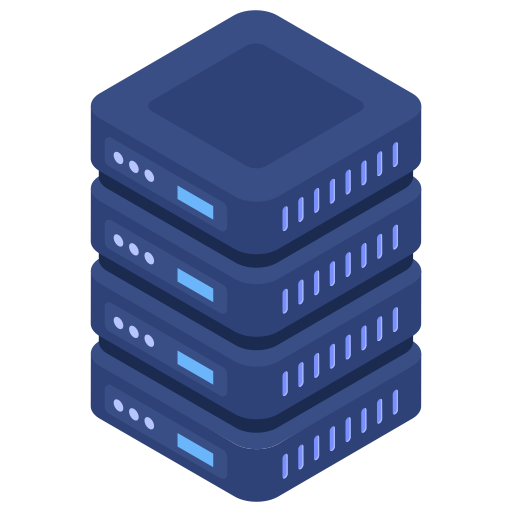

<p align="center">
  <a href="" rel="noopener">
 </a>
</p>

<h3 align="center">Food trucks</h3>

<div align="center">

[]()
[](https://github.com/kylelobo/The-Documentation-Compendium/issues)
[](https://github.com/kylelobo/The-Documentation-Compendium/pulls)
[](/LICENSE)

</div>

---

<p align="center">
Application focused on the backend , using express and typescript.
Mongodb as database and using NEXT JS for servers side rendering the UI.

This is just production application for own case, nothing that will be in production. That's why some error messages that I handle is there for a special purpose. Just to understand the code on what's going on. I know that in a real case you would have write in a more a anonymous way. 🧛‍♂️
<br>

</p>

## 📝 Table of Contents

- [About](#about)
- [Getting Started](#getting_started)
- [Built Using](#built_using)
- [TODO](../TODO.md)
- [Contributing](../CONTRIBUTING.md)
- [Authors](#authors)
<!-- - [Acknowledgments](#acknowledgement) -->

## 🧐 About <a name = "about"></a>

Practicing on building a fullstack modern application. Using server side rendered content with Next js.

## 🏁 Getting Started <a name = "getting_started"></a>

These instructions will get you a copy of the project up and running on your local machine for development and testing purposes. See [deployment](#deployment) for notes on how to deploy the project on a live system.

```bash
  git clone <project url>

  cd <project name> / server or frontend


  yarn/npm install (in both server and client)

  yarn/npm start in server
  yarn/npm dev in client

```

### Prerequisites

What things you need to install the software and how to install them.

```
 Node > 8.0

```

<!-- ### Installing

A step by step series of examples that tell you how to get a development env running.

Say what the step will be

```
Give the example
```

And repeat

```
until finished
```

End with an example of getting some data out of the system or using it for a little demo. -->

<!-- ## 🔧 Running the tests <a name = "tests"></a> -->

<!-- ### And coding style tests

Explain what these tests test and why

```
Give an example
``` -->

## ⛏️ Built Using <a name = "built_using"></a>

- [MongoDB](https://www.mongodb.com/) - Database
- [Express](https://expressjs.com/) - Server Framework
- [React](https://reactjs.org/) - Web Framework
- [NodeJs](https://nodejs.org/en/) - Server Environment
- [Next Js](https://nextjs.org/) - Framework for React
- [Typescript](https://www.typescriptlang.org/) - Superset of Javascript

## ✍️ Authors <a name = "authors"></a>

- [@masiuciszek](https://github.com/masiuciszek) - Me

<!-- See also the list of [contributors](https://github.com/kylelobo/The-Documentation-Compendium/contributors) who participated in this project. -->

<!-- ## 🎉 Acknowledgements <a name = "acknowledgement"></a>

- Hat tip to anyone whose code was used
- Inspiration
- References -->
